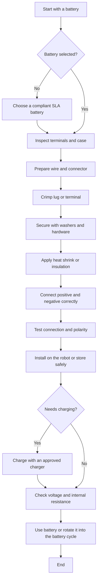

## FRC Batteries

FRC uses 12-Volt 18 Amp-Hour Sealed Lead Acid (SLA) batteries. These batteries are the Absorbed Glass Mat (AGM) type, which contain fiberglass mats with absorbed battery acid, instead of free-flowing liquid. This reduces the consequences of a spill and results in safer batteries. 

SLA batteries are intended for use in lower current applications, with nominal outputs between 1 to 15 amps and can last many years in these conditions. Under FRC conditions, which average around 50-60 amps continuous through the match, batteries tend to last 1-2 years before becoming unsuitable for matches.

!!! warning
    While AGM batteries are safer than free-flowing liquid batteries, battery acid is still an extremely strong acid, as well as being highly toxic. If a battery is dropped, cracked, or you see any white powdery residue on it, dispose of the battery safely following your team's battery disposal procedures.

## Battery Wiring

{ width="50%", align=left }

1. The battery itself.
2. The lug and connectors attaching wires to the battery.
3. Thick gauge battery wires.
4. An Anderson SB-series connector.

<!-- This is really stupid, but I can't figure out how to end the align=left from the picture above, and this bypasses that. -->
 
 
 
 
 
 
 
 
 
 
 
 
 

### 1. Anderson SB Connectors
There are two types of Anderson SB connectors permitted for use as FRC battery connectors; the SB50 and SB120. The SB50 is the most common, and is rated for 6AWG wire. SB50 connectors are used on batteries from FRC spares kits, as well as those that come as part of the rookie kit of parts. The SB120 is rated for 2, 4, or 6AWG wire. 

SB connectors are color coded, and do not interconnect between colors. For the SB50, red is the most common color. For the SB120, blue is the most common color. Using a less common color may prevent borrowing or sharing batteries with other teams.

### 2. Battery Wires
The most common wire gauge for FRC battery wires is 6AWG. 4 AWG, or 2 AWG, are also allowed, and provide slightly improved conductivity in testing. While switching to 4 AWG or 2 AWG provides some benefits, 

### 3. Lugs and Connection
FRC battery terminals are designed for use with lugs compatible with #10-32 or M5 screw holes. Lugs must be sized appropriately for the wire gauge being used. 

!!! warning
    The hardware that comes with the battery at purchase are usually extremely low quality, and may loosen during matches, leading to a faulty connection and loss of power. It's is highly recommended to replace them with better hardware.

#### Recommended Lugs
| Wire Size | Lug Orientation | FerrulesDirect SKU | Link |
| --------- | --------------- | ------------------ | ------------------- |
| 6AWG | Straight | SB610 | [FerrulesDirect](https://www.ferrulesdirect.com/products/sb610) |
| 6AWG | Right Angle | SBF610 | [FerrulesDirect](https://www.ferrulesdirect.com/products/sbf610) |
| 4AWG | Straight | SB410 | [FerrulesDirect](https://www.ferrulesdirect.com/products/sb410) |
| 4AWG | Right Angle | SBF410 | [FerrulesDirect](https://www.ferrulesdirect.com/products/sbf410) |
| 2AWG | Straight | SB210 | [FerrulesDirect](https://www.ferrulesdirect.com/products/sb210) |
| 2AWG | Right Angle | SBF210 | [FerrulesDirect](https://www.ferrulesdirect.com/products/sbf210) |

### 4. The Battery
The most commonly used batteries in FRC are the MK Battery ES17-12, the Duracell DURA12-18NB, and the Energizer EN18-12. These can be purchased from FRC vendors, or from most automotive vendors. If purchasing batteries in person, check the date of manufacture. Batteries that have sat on the shelf for a long period of time may have lost some of their total capacity. To understand what specs make a battery legal, please see [R601](https://www.frcmanual.com/2026/robot-construction-rules-(r)#r601-battery-limit-everyone-has-the-same-power).

### The Connector, Lug, and Wire
* The [Lug](https://newwiremarine.com/product/battery-lug/) (generic product link attached) can be from practically anywhere. The only requirements it needs to have is that it is rated for 10-32 hole sizing and whatever wire gauge you choose to use. The terminal should be whatever comes with the connector.
* The Battery crimp is extremely important. The [iCrimp Crimper](https://www.icrimptools.com/products/iwiss-hx-50b-cross-border-crimping-pliers-wiring-pliers-bare-terminal-pliers-yo-copper-aluminum-cable-crimping-pliers-6-50mm2?variant=42722324611233&country=US&currency=USD&utm_medium=product_sync&utm_source=google&utm_content=sag_organic&utm_campaign=sag_organic&cmp_id=22605560113&adg_id=&kwd=&device=c&utm_term=&utm_campaign=B2C+-+New+and+Existing+Customers+-+Perfomance+Max+-+Sale&utm_source=adwords&utm_medium=ppc&hsa_acc=7336915727&hsa_cam=22605560113&hsa_grp=&hsa_ad=&hsa_src=x&hsa_tgt=&hsa_kw=&hsa_mt=&hsa_net=adwords&hsa_ver=3&gad_source=1&gad_campaignid=22595559102&gbraid=0AAAAAD3ralOpgLD6W26ZBrohaE5P-MYUa&gclid=CjwKCAjwuuPRBhAnEiwA2Ji8evZTr5803jmrVq-7P3k5naQsNKxGMivJepo2QYzHoe-6stGGP_HpphoCMsgQAvD_BwE) is recommended
* Step 1: Strip your wire to the length of the terminal or the lug. For exact measurements, check the documentation or compare the length to the terminal/lug with your eyeball. 
  * The wires you will be using are high gauge and regular strippers won't work on them. Therefore, you should use a pair of flush cutters and be careful to not nick any strands (if this is done, cut off the end and try again). 
  * Fingers may also be used to peel back the insulation with risk to your skin.
* Step 2 (FOR LUGS ONLY): Place the heatshrink on for the lugs. This should be done now rather than later as lugs and terminals may be bulky.
* Step 3: Crimp the connector. Usually your crimper will have a hexagonal die and will sometimes have the millimeter number on it. 
  * For 4 AWG use the 25 setting, as 25mm^2 is equal to 4 AWG. 
  * For 6 AWG use the 16 setting with the same logic. 2 crimps for each terminal/lug is recommended for optimal grip onto the wire. 
  * This crimp takes a lot of force and may be hard for some so assistance can always be asked for.
* Step 4 (FOR LUGS): For lugs, perform the steps described in [Battery Assembly](contributions/link), and then, being careful to not allow any metal (including the metal already on the battery) to be exposed, move forward and heat up the heat shrink.
* Step 4 (FOR CONNECTORS): once both wires are done, place them into the connector, with red as positive and black as negative. The hook should go over the metal bit at the end and a click should be heard. To undo, use a flathead screwdriver to pry the hook over the metal bit.

## Battery Process Flowchart
The following flowchart summarizes the typical battery workflow from selection through assembly, charging, and checks.

## Maintaining Your Battery
What you need to do to make sure your battery remains competitive!

### Charging
* The [AndyMark NOCO Chargers](https://andymark.com/products/frc-battery-charger?srsltid=AfmBOoqwFmhqzrKGyEGLmltHpnLuQzWZ-Z9BuJ_KRqhnXo1Yxh9rbe2H) are heavily recommended. These come with FRC connectors and are very good chargers.

### Checks
* [CTRE’s Battery Beak](https://store.ctr-electronics.com/products/battery-beak?srsltid=AfmBOorYtOxTG61A61ysMHFyl9BZpIvloOV9aF1eHups2mpyPCVNX0zS) is a tool for quick battery checks during competition: it’ll let you know whether your battery is good or not with a simple plug in to your battery. If you are using a SB120 get the [CTRE Adapter](https://store.ctr-electronics.com/products/sb120-to-sb50-adapter-cable?pr_prod_strat=e5_desc&pr_rec_id=a7835906b&pr_rec_pid=8329799860397&pr_ref_pid=7863765467309&pr_seq=uniform) or for a cheaper cost, create the adapter yourself with an SB50 set, SB120 set and 6 AWG wires.
  * For matches:
    * Ideally under 15 milliohms internal resistance.
    * Ideally at least 120% at the top left. 130%+ is incredibly ideal.
  * For testing:
    * Under 20 milliohms. If your battery is over 20 milliohms, do not use it at all on your robot, as it will demonstrate poor performance.

### Overall Health Tests
* For basic health tests, the battery beak with internal resistance can be used. However, for capacity tests and overall health tests a dedicated tool should be used.
* Cheaper Option: Use a car battery checker. This will provide for a great overall health test. Purchase an [analyzer](https://www.amazon.com/dp/B07Z67MMGC) and crimp either an SB120 or 50 to it.
* If you want to do an actual capacity test and have the money, get a [CBA](https://andymark.com/products/computerized-battery-analyzer?srsltid=AfmBOooGLWRoXcV3QuroNVp4GET2FpbFHrLxtE4HO8NeLZByQJkEZoeH). 
  * It graphically displays and charts the voltage versus time under a constant current load. Graphs can be displayed, saved and printed, and axis parameters can be changed at any time. 
  * Multiple test graphs of the same battery, or multiple batteries, may be compared or overlaid.

### Best Practices
!!! tip "Best Battery Practices"
  * Always write down when the battery is first used: You can use the AndyMark stickers that come with the kit or just use a sharpie and some tape. Label month and year.
  * Have a set circulation of batteries at competition. Regulate based on the performance of each battery.

