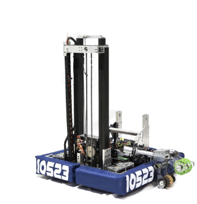
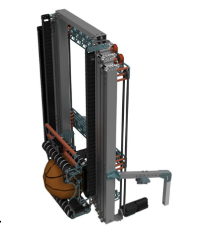

# Specific Mechanism Wiring

## Turret
Turrets rotate and electronics on whatever mechanism is on said turret need to get power. The wires that go to them can break, however. Thus, we need methods to effectively transfer power/CAN. Two main ways are used to do this, both involving a BIGUS chain.

There are two suggested methods to wiring a Turret
- [CF Spring BIGUS](assets/PXL_20260220_0440071372.mp4)

- [Bending BIGUS](https://youtube.com/shorts/g33nFoGUTaQ?si=z2qUZRFscW2Fu6Qe)

## Elevator
The elevator carriage should be wired with a [BIGUS chain](https://www.igus.com/cable-carriers). This chain should be included in CAD with mounting points provided on elevator crossbeams. Ensure that the motion of any other subsystem (such as an end effector) does not interfere with the possible gravitational motion of the energy chain when moving linearly.

  
   
  

## Slapdown/ 4-Bar Intake

## Drivetrains
- All of the electronics placement should be done in CAD. The electrical team should work with CAD to ascertain these locations. They can be fastened within either mounting holes, VHB, or Zipties. Grommet holes and grommets should be put into tubes so that wires can easily pass through without risk of damage.

### Brain Pans
- Brainpans (electronics underneath the bellypan of the robot) can be used to minimize the space that electronics take up. This can be for games where maximizing space on the robot is everything (i.e. Rebuilt™)
- This has tradeoffs:
  * Pro: Electronics/Wires take up minimal space on the robot
  * Con: It is generally harder to solve wiring issues
- In usage, ensure that electronics are protected and have easy access

