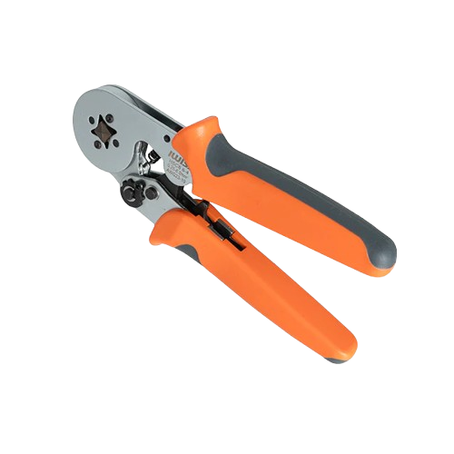
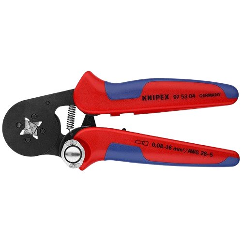

# Tools, Wire, and Crimps

## Ferrules
### Ferrule Crimper
=== "Budget Pick"
    [iWiss Square Ferrule Crimper](https://wcproducts.com/products/iwiss-tools)

    { align= center }
=== "Quality Pick"
    [Knipex 97 53 04](https://www.digikey.com/en/products/detail/knipex-tools-lp/97-53-04/10451678)

    { align=center }

### Ferrule Crimps

| AWG Size | Pin Length | FerrulesDirect SKU | Description | FerrulesDirect Link |
| -------- | ---------- | ------------------ | ----------- | ------------------- |
| 8AWG | 12mm | AW100012 | Powering high current devices | [FerrulesDirect](www.ferrulesdirect.com/collections/insulated-wire-ferrules/products/aw100012) |
| 10AWG | 12mm | AW60012 | Powering high current devices | [FerrulesDirect](https://www.ferrulesdirect.com/collections/insulated-wire-ferrules/products/aw60012) |
| 12AWG | 12mm | AW40012 | Anderson Powerpole connections | [FerrulesDirect](https://www.ferrulesdirect.com/collections/insulated-wire-ferrules/products/aw40012) |
| 18AWG | 12mm | AW10012 | Powering low current devices  | [FerrulesDirect](https://www.ferrulesdirect.com/collections/insulated-wire-ferrules/products/aw10012) |
| 18AWG | 8mm | AW10008 | Powering low current devices | [FerrulesDirect](https://www.ferrulesdirect.com/collections/insulated-wire-ferrules/products/aw10008) |
| 22AWG | 12mm | AW05012 | Powering low current devices | [FerrulesDirect](https://www.ferrulesdirect.com/collections/insulated-wire-ferrules/products/aw05012) |
| 22AWG | 8mm | AW05008 | Signal wire | [FerrulesDirect](https://www.ferrulesdirect.com/collections/insulated-wire-ferrules/products/aw05008) |

!!! info

    12mm Pin Length Ferrules are better for inserting a wire into Power Distribution (like a PDH, PDP, AMPD), and 8mm ferrules are better in weidmueller terminals.

## MolexSL
### Molex Tool
=== "DigiKey"
    [Purchase Link](https://www.digikey.com/en/products/detail/molex/0638118700/1832243)

    { align = center }
=== "Mouser"
    [Purchase Link](https://www.mouser.com/ProductDetail/Molex/63811-8700?qs=kaOkW4VzSzcoF%2FkuYEQlmw%3D%3D)

    { align = center }
=== "FIRST Choice"
    Historically, the Molex tool has always been in FIRST Choice, for free (spending your credits).

    { align = center }

### Molex Crimps

| Part Type | Molex Part Number | Description | DigiKey Link | Mouser Link |
| --------- | ----------------- | ----------- | ------------ | ----------- |  
| Terminals (22-24AWG, 0.38um gold MIN) | 16-02-0103 | Female, Loose | [DigiKey](https://www.digikey.com/en/products/detail/molex/0016020103/115063) | [Mouser](https://www.mouser.com/ProductDetail/Molex/16-02-0103?qs=ej2heXsoscEtQBg0xGzF4Q%3D%3D) |
| | 16-02-0115 | Male, Loose | [DigiKey](https://www.digikey.com/en/products/detail/molex/0016020115/171959) | [Mouser](https://www.mouser.com/ProductDetail/Molex/16-02-0115?qs=UAyrm%2FnZ%252BChKVUHstJTaLA%3D%3D) |
| Housings (CPA/TPA capable) | 050-57-9702 | Receptacle (Female Terminal), 2 Circuit | [DigiKey](https://www.digikey.com/en/products/detail/molex/0050579702/2421209) | [Mouser](https://www.mouser.com/ProductDetail/Molex/50-57-9702?qs=O7pb%252BE5gJ7RxVMEHNkkPqg%3D%3D) |
| | 050-57-9703 | Receptacle (Female Terminal), 3 Circuit | [DigiKey](https://www.digikey.com/en/products/detail/molex/0050579703/2731437) | [Mouser](https://www.mouser.com/ProductDetail/Molex/50-57-9703?qs=O7pb%252BE5gJ7ToCA9wCwmfmw%3D%3D) |
| | 050-57-9704 | Receptacle (Female Terminal), 4 Circuit | [DigiKey](https://www.digikey.com/en/products/detail/molex/0050579704/2731443) | [Mouser](https://www.mouser.com/ProductDetail/Molex/50-57-9704?qs=O7pb%252BE5gJ7QDyJl7w6xJZg%3D%3D) |
| | 050-57-9706 | Receptacle (Female Terminal), 6 Circuit | [DigiKey](https://www.digikey.com/en/products/detail/molex/0050579706/2731446) | [Mouser](https://www.mouser.com/ProductDetail/Molex/50-57-9706?qs=O7pb%252BE5gJ7Tc2Ca5UBEi0w%3D%3D) |
| | 70107-5002 | Plug (Male Terminal), TPA, 2 Circuit | [DigiKey](https://www.digikey.com/en/products/detail/molex/0701075002/5629362) | [Mouser](https://www.mouser.com/ProductDetail/Molex/70107-5002?qs=c8NFF48pVsDGyQiESfXyIw%3D%3D) |
| | 70107-5003 | Plug (Male Terminal), TPA, 3 Circuit | [DigiKey](https://www.digikey.com/en/products/detail/molex/0701075003/5629363) | [Mouser](https://www.mouser.com/ProductDetail/Molex/70107-5003?qs=c8NFF48pVsDnNiZNRhag%2FQ%3D%3D) |
| | 70107-5004 | Plug (Male Terminal), TPA, 4 Circuit | [DigiKey](https://www.digikey.com/en/products/detail/molex/0701075004/5629364) | [Mouser](https://www.mouser.com/ProductDetail/Molex/70107-5004?qs=c8NFF48pVsAiBF3Rm5aROg%3D%3D) | 
| | 70107-5006 | Plug (Male Terminal), TPA, 6 Circuit | [DigiKey](https://www.digikey.com/en/products/detail/molex/0701075006/5629366) | [Mouser](https://www.mouser.com/ProductDetail/Molex/70107-5006?qs=c8NFF48pVsBUI4RLgGhycA%3D%3D) |
| Inserts | 74109-0001 | CPA Insert | [DigiKey](https://www.digikey.com/en/products/detail/molex/0741090001/9351972) | [Mouser](https://www.mouser.com/ProductDetail/Molex/74109-0001?qs=sGAEpiMZZMvlX3nhDDO4AOuCP5L27%252B9mkeVyJh7TMOQ%3D) |
| | 73838-0002 | TPA Insert, 2 Circuits | [DigiKey](https://www.digikey.com/en/products/detail/molex/0738380002/4134819) | [Mouser](https://www.mouser.com/ProductDetail/Molex/73838-0002?qs=O7pb%252BE5gJ7S%2FmdHSVMwzaw%3D%3D) |
| | 73838-0003 | TPA Insert, 3 Circuits | [DigiKey](https://www.digikey.com/en/products/detail/molex/0738380003/3044678) | [Mouser](https://www.mouser.com/ProductDetail/Molex/73838-0003?qs=O7pb%252BE5gJ7ReqNV3gB1fuA%3D%3D) |
| | 73838-0004 | TPA Insert, 4 Circuits | [DigiKey](https://www.digikey.com/en/products/detail/molex/0738380004/4134820) | [Mouser](https://www.mouser.com/ProductDetail/Molex/73838-0004?qs=O7pb%252BE5gJ7TxCOXFCM338Q%3D%3D) |
| | 73838-0006 | TPA Insert, 6 Circuits | [DigiKey](https://www.digikey.com/en/products/detail/molex/0738380006/3468863?s=N4IgTCBcDaIAwHYDMAOVcMDYQF0C%2BQA) | [Mouser](https://www.mouser.com/ProductDetail/Molex/73838-0006?qs=O7pb%252BE5gJ7SNNrUqdbktmg%3D%3D) |

## Ring Terminals
!!! note

    Ring terminals are only seen on the WCP Kraken X60 / X44, and the CTRE TalonFXS.

### Ring Terminal Crimper
=== "Budget Pick"
    [iCrimp IWS-16 (22awg-6awg)](https://www.amazon.com/dp/B07QXNF8XW?rsd=GICVhQ9MOzh99rXecptowWPtPRL93kVbiwEww%2BN3F5zzPfyfw2QAMMx9jqzCu45nUOdVP6REhwjzwhUQbvUFSqGalcKnDzrKxf1l4TN6gmZ4nQ%2Bh&edk=AQIDAHi1lw%2FM8UbbSMD9ScOOFEmBMHMthHeEhqDaQYPJUAX3jQFxu1b1PptRTX%2FvCtqyC6HwAAAAfjB8BgkqhkiG9w0BBwagbzBtAgEAMGgGCSqGSIb3DQEHATAeBglghkgBZQMEAS4wEQQMZRV6P4Us%2By8rbUsmAgEQgDt34rkfZifgSptsD8W2zDNHw2YK8qAyIdvZ3M%2F%2BKRMMTPm0Po5xZSERHVM4ckfJ4bnSRVnSiUOJ%2FWrRMA%3D%3D)

    .png)
=== "Quality Pick"
    [Molex 0640030100](https://www.digikey.com/en/products/detail/molex/0640030100/592465)
    
    

### Ring Terminal Crimps

| Part Type | Part Number | Description | CTRE Link | Other Link |
| --------- | ----------- | ----------- | --------- | ---------- |
| 10AWG | CTRE: 23-108284 | Ring Terminal for Kraken / TalonFXS Power | [CTRE](https://store.ctr-electronics.com/products/ring-terminal-connector-pack-of-10?variant=43631142174893) | [DigiKey](https://www.digikey.com/en/products/detail/molex/0190690232/2421411) |
| 22AWG | CTRE: 23-228284 | Ring Terminal for Kraken / TalonFXS CAN | [CTRE](https://store.ctr-electronics.com/products/ring-terminal-connector-pack-of-10?variant=43631142142125) | na | 

## Andersons

### Anderson Crimpers
=== "Budget Pick"
    [iWiss Powerpole Crimper](https://wcproducts.com/products/iwiss-tools)

    

=== "Quality Pick"
    [Powerwerx Powerpole Crimper](https://powerwerx.com/tricrimp-powerpole-connector-crimping-tool)

    

### Anderson Crimps
| Part Type | Part Number | Description | WCP Link | Other Link |
| --------- | ----------- | ----------- | --------- | ---------- |
| 45A Red Connector | WCP-2529 | Red Connector Housing | [WCP](https://wcproducts.com/products/wire-contacts-connectors) | [CTRE](https://store.ctr-electronics.com/products/anderson-powerpole-pp15-45) | 
| 45A Black Connector | WCP-2530 | Black Connector Housing | [WCP](https://wcproducts.com/products/wire-contacts-connectors) | [CTRE](https://store.ctr-electronics.com/products/anderson-powerpole-pp15-45) |
| 45A White Connector | WCP-2531 | White Connector Housing | [WCP](https://wcproducts.com/products/wire-contacts-connectors) | [CTRE](https://store.ctr-electronics.com/products/anderson-powerpole-pp15-45) |
| 45A Contact | WCP-2532 | 45A Powerpole Contact | [WCP](https://wcproducts.com/products/wire-contacts-connectors) | [CTRE](https://store.ctr-electronics.com/products/anderson-powerpole-contact) |

## Wire Strippers
### Battery
=== "Budget Pick"
    [Jonard Tools CST-1900](https://www.amazon.com/gp/product/B0069627PA?linkId=0b213ec3eef054b7c26d5fc4e0522e33&language=en_US)

    
=== "Quality Pick"
    [Knipex 16 30 135](https://www.digikey.com/en/products/detail/knipex-tools-lp/16-30-135-SB/10451750)

    

### Non-Battery
=== "Budget Pick"
    [Knipex 12 62 180](https://www.digikey.com/en/products/detail/knipex-tools-lp/12-62-180/10451692)

    
=== "Quality Pick"
    [AutomationDirect DN-WS](https://www.automationdirect.com/adc/shopping/catalog/tools_-a-_test_equipment/pliers_-a-_cutting_tools/wire_-a-_cable_stripping_tools/dn-ws)

    

## Flush Cutters
=== "Budget Pick"
    [iWiss Diagonal Flush Cutters](https://wcproducts.com/products/iwiss-tools)

    
=== "Quality Pick"
    [Knipex 78 91 125](https://www.knipex-tools.com/products/electronics-pliers/knipex-super-knips-electronics-pliers/electronics-super-knips/7891125)

    

## Wire

### Power
| AWG | Brand | Link | 
| --- | ----- | ---- |
| 10AWG | BNTECHGO | [BNTECHGO](https://www.amazon.com/BNTECHGO-Flexible-Conductor-Resistant-Extension/dp/B086KXW46L) |
| | West Coast Products | [WCP](https://wcproducts.com/products/wire) |
| | The Thrifty Bot | [TTB](https://www.thethriftybot.com/products/25-feet-bonded-10-awg-flexible-silicone-jacketed-wire) |
| 12AWG | BNTECHGO | [BNTECHGO](https://www.amazon.com/BNTECHGO-Flexible-Conductor-Resistant-Extension/dp/B07CZYT6RG) |
| | West Coast Products | [WCP](https://wcproducts.com/products/wire) |
| | The Thrifty Bot | [TTB](https://www.thethriftybot.com/products/50-feet-bonded-12-awg-flexible-silicone-jacketed-wire) |
| 18AWG | BNTECHGO | [BNTECHGO](https://www.amazon.com/BNTECHGO-Flexible-Conductor-Resistant-Extension/dp/B0779QRR58) |
| | West Coast Products | [WCP](https://wcproducts.com/products/wire)
| | The Thrifty Bot | [TTB](https://www.thethriftybot.com/products/25-feet-bonded-18-awg-flexible-silicone-jacketed-wire) |
| 22AWG | BNTECHGO | [BNTECHGO](https://www.amazon.com/BNTECHGO-Silicone-Flexible-Strands-Stranded/dp/B01K4RPF1C) |
| | West Coast Products | [WCP](https://wcproducts.com/products/wire) |

### CAN
| Brand | Description | Link |
| ----- | ----------- | ---- | 
| West Coast Products | Twisted CAN Wire | [WCP](https://wcproducts.com/products/wire) |
| | Jacket CAN Wire (Comes in Black, White, Grey) | [WCP](https://wcproducts.com/products/wire) |
| Cross The Road Electronics | Twisted CAN Wire | [CTRE](https://store.ctr-electronics.com/products/can-bus-cable?variant=43631131656365) |
| Automation Direct | Continous Flex CAN Wire | [Automation Direct](https://www.automationdirect.com/adc/shopping/catalog/bulk_wire_-a-_cable/low_voltage_control_-a-_signal_cable/cf211-02-01-02-1) |
| ProWireUSA | Green / Violet CAN Wire | [ProWireUSA](https://www.prowireusa.com/p-2170-22-awg-x-2-twisted-pair-green-violet-1tpi.html) | 
| ProWireUSA | Yellow / Green CAN Wire | [ProWireUSA](https://www.prowireusa.com/p-2171-22-awg-x-2-twisted-pair-yellow-green-1tpi.html) | 
| ProWireUSA | Green / Blue CAN Wire | [ProWireUSA](https://www.prowireusa.com/p-2172-22-awg-x-2-twisted-pair-green-blue-1tpi.html) |
| ProWireUSA | Green / White CAN Wire | [ProWireUSA](https://www.prowireusa.com/p-2175-22-awg-x-22-twisted-pair-green-white-1tpi.html) | 
!!! info
    Continous Flex CAN Wire is useful in mechanisms that move a lot (like a turret, elevator, etc).